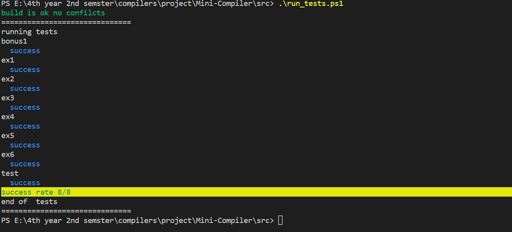

# Mini-Compiler

It’s a project about creating a compiler using lex and yacc for a simple language.

# Installation

- make sure you have make installed `make -v`
- make sure you have gcc installed `gcc -v`
- make sure you have bison installed `bison -V`
- make sure flex is installed `flex -V`

# testing the compiler run ( in **powershell** )

## running test in **powershell**

- `cd .\src\`
- put the file you want to test inside `./src/examples` folder
- `.\run_tests.ps1` --> this will build and run the tests in `/src/examples` folder

## output from test

